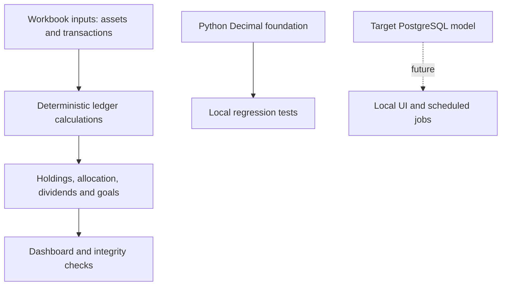

# Investor OS - An auditable personal investing toolkit

**English** | [Português (Brasil)](README.pt-BR.md)


Track holdings, dividends, allocation and goals with transparent, deterministic calculations.

**[Public product preview](https://investor-os-app.pages.dev/)** · Public source repository · Documentation checked on **2026-10-01**.

[Snapshot: Public landing page, desktop, 2026-10-01](https://drive.google.com/file/d/1nmM5L_m1S-PdOMEbbOeNIgHnR2rwDtpS/view?usp=drivesdk)

> The public URL is a landing page, not a working portfolio dashboard. Repository documents describe an implemented V1 workbook; external beta and distribution gates remain open. The repository also contains a small Python calculation foundation. A hosted subscription app is not implemented by the planned-stack list.

## Contents

- [Idea and planning](#idea-and-planning)
- [Features and scope](#features-and-scope)
- [Architecture](#architecture)
- [Design and snapshots](#design-and-snapshots)
- [Development process](#development-process)
- [Performance](#performance)
- [Security and privacy](#security-and-privacy)
- [Testing and local run](#testing-and-local-run)
- [Release and roadmap](#release-and-roadmap)
- [Credits and license](#credits-and-license)

## Idea and planning

Portfolio information often lives in broker screens and custom spreadsheets. Investor OS aims to bring cost basis, dividends, allocation and goals together while keeping every formula inspectable. It starts with a spreadsheet and a personal-first foundation, not with an opaque financial AI.

| User need | Planned response |
| --- | --- |
| Understand remaining cost after a partial sale. | Weighted-average cost, with fees, tax and currency conversion. |
| See where my portfolio is concentrated. | Allocation by asset, sector, type, country/region and currency. |
| Trust an imported number. | Source, observation time, effective time and currency records. |
| Keep personal control and avoid recurring service costs. | Local-first delivery before hosted accounts or billing. |

Goals: transparent calculations, useful summaries, manual overrides and auditable data. Non-goals: brokerage execution, personalized securities recommendations, automated trading, tax filing, high-frequency prices and social features.

## Features and scope

**V1 workbook, as documented:** holdings and transaction ledger, weighted-average cost, dividends/reconciliation, FX conversion, allocation, goals, dashboard charts and integrity checks with fictional sample data. Manual prices and FX are intentional, not a live market feed.

**Python foundation in this repository:** `Decimal` arithmetic, chronological trade ordering, purchase cost including fees/tax/FX, partial-sale cost reduction, full-sale reset and rejection of overselling.

**Not yet a delivered web dashboard:** authentication, multi-user sync, broker connection, automated price feeds, subscription billing and public distribution.

## Architecture



| Stage | Technology | Status / reason |
| --- | --- | --- |
| V1 product | Excel / LibreOffice-compatible workbook | Implementation is described in product docs; simple inspection of inputs and formulas. |
| Calculation foundation | Python standard library, Decimal | Present in `src/investor_os/portfolio.py`; deterministic arithmetic. |
| Data model | PostgreSQL schema | Model in `database/`; not proof of a running hosted database. |
| Personal-first target | Local UI, local scheduled jobs, CSV/JSON export and encrypted backups | Future delivery in [architecture](docs/architecture.md). |
| Public website | Product landing page | Preview of the product, not account/portfolio functionality. |

[Architecture](docs/architecture.md) is the current personal-first, zero-cost direction. Older product proposals mention Next.js, Supabase, n8n Cloud, Vercel, OpenAI workflows and Gumroad. Those are historical/planned options, not installed services or subscriptions. Current architecture rejects services requiring cards, trials or automatic overage. AI is not used for deterministic financial arithmetic.

## Design and snapshots

Snapshots are stored privately in the owner's Drive. The links require access; they are not public image embeds. Repository image upload failed during this update, so there are no broken placeholder images.

The current public preview uses a dark background, green accents, numbered feature descriptions and an explicit development status. Workbook design separates inputs, calculated areas, checks and onboarding.

| Snapshot | Date | Context |
| --- | --- | --- |
| [Desktop landing](https://drive.google.com/file/d/1nmM5L_m1S-PdOMEbbOeNIgHnR2rwDtpS/view?usp=drivesdk) | 2026-10-01 | Public product introduction, no portfolio data. |
| [Mobile landing](https://drive.google.com/file/d/1aNNB_NO_bI5u_5ICVVCJ071dzct47EJP/view?usp=drivesdk) | 2026-10-01 | Responsive public introduction, 390px viewport. |

These are landing-page images, not dashboard screenshots. Earlier wireframes and a workbook dashboard capture have not been collected here. Add them only from verified artifacts with synthetic data; never substitute a mockup for a working screen without labelling it.

## Development process

1. Define V1 goals, non-goals and a transparent calculation principle.
2. Specify workbook sheets, formulas and checks in [XLSX implementation](product/xlsx-implementation.md).
3. Build the workbook stage and record validation gates in [release checklist](product/release-checklist.md).
4. Establish the personal-first architecture, Python calculation core and local regression tests.
5. Restore a clean repository with synthetic fixtures on 2026-09-30. This describes the current repository, not deletion from every possible cache or copy.
6. Add bilingual documentation, dated public snapshots and MIT on 2026-10-01.

Exact changes remain in Git history. Future changes should record the requirement, decision, implementation, test result and snapshot together. Unverified early dates and approvals are not reconstructed.

## Performance

No measured dashboard response time, throughput or Core Web Vitals baseline is available in the inspected repository documentation. The landing page is not a benchmark of portfolio calculations.

Before claiming speed, measure dataset size, import/calculation time, memory, hardware, Python/browser version and commit. Before a web dashboard release, add dated LCP/INP/CLS measurements and realistic synthetic portfolio scenarios.

## Security and privacy

- Use fictional portfolios in fixtures, docs and screenshots. Do not commit broker exports, balances, credentials or private identifiers.
- The current restored tree uses synthetic sample data. No claim is made that all previous copies or third-party caches were erased.
- Financial formulas are deterministic, not AI guesses. This is portfolio organization, not investment advice or a tax calculation certificate.
- [Beta tracker](product/beta-tracker.md) is intended to be anonymized. Verify the outgoing artifact before sharing it with testers.
- Secrets belong outside Git. Local-first and encrypted backup are target requirements, not proof that every current artifact is encrypted.
- No paid service or hosted CI was enabled by this documentation update. Keep GitHub-hosted Actions off until billing limits are verified, as required by the architecture notes.

## Testing and local run

### Synthetic trade test

An invented three-company portfolio can now be loaded into the Python core:

```sh
PYTHONPATH=src python3 -m investor_os.sample_portfolio
```

[Setup, format, expected results and privacy boundary](docs/synthetic-portfolio.md).
14 local tests passed on 2026-10-07. This CLI is not a web dashboard or broker importer.


The V1 [release checklist](product/release-checklist.md) records 20 workbook cases used for validation, but external testers and public-release gates remain unchecked. This update did not obtain or rerun the workbook, so it does not independently certify those 20 results.

The current Python `tests/test_portfolio.py` contains four tests: partial sale, FX/fees/tax, full-sale reset and oversell rejection. **All four passed locally on 2026-10-01 using the source fetched from this repository.** This is a narrow calculation-core result, not an end-to-end product test.

```sh
# From repository root, with Python 3 available:
PYTHONPATH=src python3 -m unittest discover -s tests -v
# Equivalent repository helper:
sh run_tests.sh
```

No third-party runtime dependency is needed for the inspected calculation module. Read [workbook implementation](product/xlsx-implementation.md) for spreadsheet conventions and setup; there is no `npm run dev` web app in this repository.

## Release and roadmap

- [ ] Complete a controlled external beta with 5-10 testers.
- [ ] Review feedback and fix usability issues.
- [ ] Complete distribution, delivery and export/backup instructions.
- [ ] Validate personal MVP import, manual price/FX updates, dashboard and checks.
- [ ] Expand regression coverage and record performance evidence.
- [ ] Consider hosted accounts, multi-tenancy and billing only after personal use and demand validation.

Do not mark the workbook production-ready until the external beta gate is complete and calculation tests pass. Publishing a README is not publishing the product.

### Repository guide

- [Current architecture](docs/architecture.md)
- [XLSX implementation](product/xlsx-implementation.md)
- [Release checklist](product/release-checklist.md)
- [Private beta scope](product/private-beta.md)
- [Tester guide](product/beta-tester-guide.md)
- [Feedback](product/beta-feedback.md)
- [Beta launch procedure](product/beta-launch-sop.md)
- [Invitation draft](product/beta-invitation.md)
- [Anonymized tracker](product/beta-tracker.md)
- [Public launch gates](product/public-launch-readiness.md)

## Credits and license

Created by Iuri Johansson. Python calculation core uses the standard library; the workbook targets Excel / LibreOffice. Planned products and third-party services retain their own terms.

[MIT license](LICENSE), copyright 2026 Iuri Johansson. The source repository is public; keep all personal financial data outside Git.
