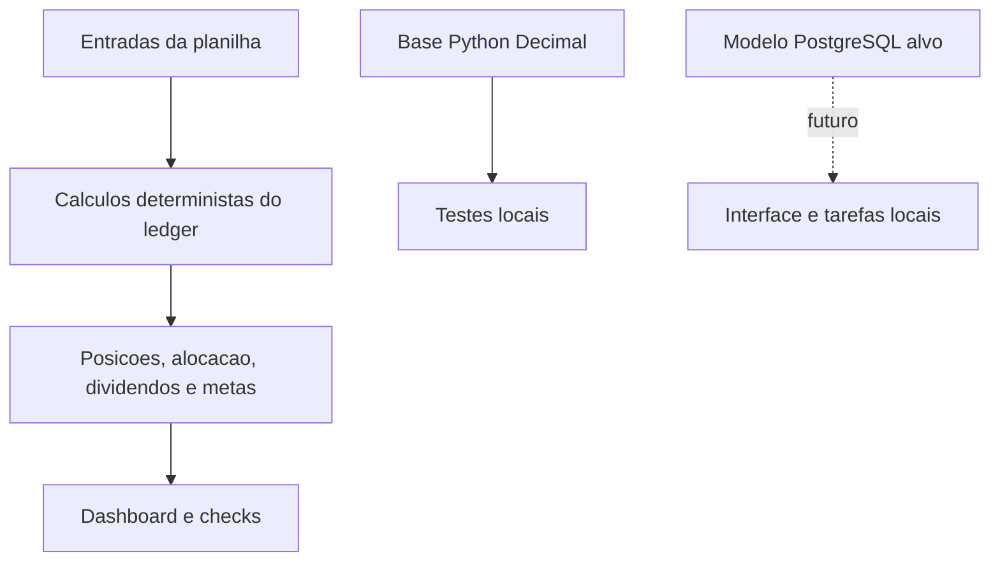

# Investor OS - Organização de investimentos com cálculos auditáveis

[English](README.md) | **Português (Brasil)**


Demo pública sintética e núcleo Python com cálculos auditáveis. Explore dados inventados; não é gestor privado de carteira.

**[Demo de dashboard sintético](https://investor-os-dashboard.pages.dev/)** · [Landing separada](https://investor-os-app.pages.dev/) · Código público · Revisão em **08/10/2026**.


> Estágio atual: demo pública sintética. Sete abas estão no `main` (`web/`) e a página ao vivo abriu em 08/10/2026: Visão geral, Posições, Operações, Proventos, Valor e exposição, Metas e cenários e Moedas. A interface tem PT-BR (padrão) e inglês, com seletor de idioma. Só essa preferência é salva localmente, não os valores financeiros. Entradas servem apenas para cenários fictícios. Sem importação real, login, corretora, backend ou armazenamento privado. Paridade de commit source/deploy não confirmada de forma independente. Gates de beta externo da planilha continuam separados.

## Ideia e planejamento

Dados da carteira ficam espalhados entre corretoras e planilhas. O Investor OS busca reunir custo médio, dividendos, alocação e metas com fórmulas inspecionáveis. Começa pela planilha e por uma base de uso pessoal, não por IA financeira opaca.

| Necessidade | Resposta planejada |
| --- | --- |
| Entender o custo após venda parcial | Custo médio com taxas, impostos e câmbio. |
| Ver concentração | Alocação por ativo, setor, tipo, país/região e moeda. |
| Conferir um número importado | Fonte, momento observado, vigência e moeda. |
| Manter controle e evitar mensalidades | Local-first antes de contas hospedadas ou cobrança. |

Objetivos: cálculos claros, resumos úteis, ajustes manuais e dados auditáveis. Fora do escopo: ordens em corretoras, recomendações individuais, trading automático, declaração de impostos, cotações de alta frequência e rede social.

## Funcionalidades e escopo

**Planilha V1, conforme documentação:** posições, transações, custo médio, dividendos/conferência, câmbio, alocação, metas, gráficos e checks com dados fictícios. Preços e câmbio manuais são intencionais, não um feed ao vivo.

**Base Python existente:** Decimal, ordenação cronológica, custo de compras com taxas/impostos/câmbio, redução de custo na venda parcial, zeragem na venda total e rejeição de venda acima da posição.

**Demo sintética atual:** visão geral/custo remanescente; busca de posições; operações fictícias; proventos com estados recebido/anunciado/estimado separados; snapshots manuais datados de valor/exposição; cenários hipotéticos de aporte/renda; exemplo multi-moeda separado com FX histórico. Exportação JSON sintética e reset disponíveis. Snapshots e hipóteses não são cotações ao vivo, previsão de investimento ou resultados financeiros certificados. Custo da fixture SEK original não é valor de mercado de todos os cenários.

**Não entregue para uso privado:** autenticação, sincronização multiusuário, corretoras, cotações automáticas, assinaturas ou importação/armazenamento de dados reais. App local Windows e backup Drive cifrado por Cryptomator são desenho futuro, não software entregue nem restauração comprovada.

## Arquitetura



| Etapa | Tecnologia e situação |
| --- | --- |
| Produto V1 | Planilha compatível com Excel/LibreOffice, descrita em product/. |
| Base de cálculos | Biblioteca padrão Python e Decimal, em src/investor_os/portfolio.py. |
| Dados | Modelo PostgreSQL em database/; não comprova banco hospedado funcionando. |
| Direção pessoal | Interface local, tarefas locais, exportação CSV/JSON e backup criptografado: trabalho futuro. |
| Dashboard público | HTML/JS estático e JSON gerado em `web/`; somente dados inventados, sem contas. |
| Landing separada | Apresentação do produto, sem carteira privada. |

[Arquitetura](docs/architecture.md) registra a direção atual: uso pessoal, local-first e custo zero. Propostas antigas citam Next.js, Supabase, n8n Cloud, Vercel, OpenAI e Gumroad; são opções históricas/planejadas, não serviços contratados. A direção atual rejeita cartão, trials e cobrança automática por excedente. IA não substitui aritmética financeira determinística.

## Design e snapshots

Capturas datadas e guardadas no próprio repositório seguem pendentes. Evidências privadas do Drive não são linkadas.

Dashboard usa fundo escuro, verde, sete abas e aviso explícito de dados fictícios. A landing separada apresenta a direção do produto, não o dashboard nem app privado. A planilha separa entradas, fórmulas, checks e onboarding.


Nenhum asset de captura está incluído neste draft. Adicionar capturas reais datadas do dashboard sintético só após revisão de privacidade e upload no repo. Rotular mockups como mockups.

## Processo de desenvolvimento

1. Definir objetivos, não objetivos e cálculo transparente.
2. Especificar abas, fórmulas e checks em [implementação XLSX](product/xlsx-implementation.md).
3. Construir a etapa de planilha e registrar gates em [checklist](product/release-checklist.md).
4. Estabelecer arquitetura pessoal, núcleo Python e regressões locais.
5. Restaurar repositório limpo com fixtures sintéticas em 30/09/2026. Isso descreve o repo atual, não exclusão de toda cópia ou cache possível.
6. Adicionar documentação bilíngue, snapshots e MIT em 01/10/2026.

Mudanças exatas ficam no Git. Registrar requisito, decisão, implementação, teste e imagem juntos. Não reconstruir datas ou aprovações não verificadas.

## Desempenho

Não há baseline medido de tempo do dashboard, throughput ou Core Web Vitals na documentação inspecionada. A landing não é benchmark dos cálculos.

Antes de afirmar velocidade, medir quantidade de dados, tempo de importação/cálculo, memória, hardware, versão Python/navegador e commit. Para dashboard web, acrescentar LCP/INP/CLS datados e cenários sintéticos realistas.

## Segurança e privacidade

- Somente carteiras fictícias em exemplos. Não versionar exportações de corretoras, saldos, credenciais ou identificadores privados.
- A árvore restaurada atual usa dados sintéticos; não se afirma exclusão de todas as cópias/cache antigos.
- Fórmulas determinísticas. Organização de carteira, não recomendação de investimento ou certificado tributário.
- [Tracker beta](product/beta-tracker.md) deve ser anonimizado; conferir o arquivo antes de compartilhar.
- Segredos fora do Git. Local-first e backup criptografado são requisitos-alvo, não prova de criptografia de todo artefato atual.
- Esta documentação não ativou serviços pagos nem CI hospedado. Manter Actions desligado até verificar billing, conforme arquitetura.

## Testes e execução local

O [checklist](product/release-checklist.md) registra 20 casos de planilha usados na validação, mas testers externos e publicação continuam pendentes. Esta atualização não obteve nem executou a planilha e não certifica esses 20 resultados de forma independente.

Verificação histórica de 01/10/2026: `tests/test_portfolio.py` continha quatro testes: venda parcial, câmbio/taxas/impostos, zeragem na venda total e rejeição de venda excessiva. **4/4 passaram localmente em 01/10/2026 com o código recuperado do repo.** É validação limitada do núcleo, não teste completo do produto.

```sh
PYTHONPATH=src python3 -m unittest discover -s tests -v
# Alternativa equivalente:
sh run_tests.sh
```

O módulo inspecionado usa apenas a biblioteca padrão Python. Consultar [XLSX](product/xlsx-implementation.md) para a planilha. O dashboard estático roda com `python3 build_demo.py` e `python3 -m http.server 8000 --directory web`. Sem runtime Node ou backend. Ver [escopo e QA da demo](docs/web-demo.md).

## Publicação e próximos passos

- [ ] Beta controlado com 5-10 testers.
- [ ] Revisar feedback e corrigir usabilidade.
- [ ] Completar distribuição, entrega e instruções de exportação/backup.
- [ ] Validar MVP pessoal: importação, ajustes de preço/câmbio, dashboard e checks.
- [ ] Ampliar regressões e medir desempenho.
- [ ] Considerar contas hospedadas, múltiplos usuários e cobrança só após validar uso pessoal e demanda.

Não rotular a planilha como produção antes do gate externo e dos testes de cálculo. Publicar README não equivale a publicar produto.

### Guia do repositório

- [Arquitetura](docs/architecture.md)
- [Implementação XLSX](product/xlsx-implementation.md)
- [Checklist](product/release-checklist.md)
- [Escopo beta](product/private-beta.md)
- [Guia do tester](product/beta-tester-guide.md)
- [Feedback](product/beta-feedback.md)
- [Procedimento beta](product/beta-launch-sop.md)
- [Rascunho do convite](product/beta-invitation.md)
- [Tracker anonimizado](product/beta-tracker.md)
- [Gates públicos](product/public-launch-readiness.md)

## Créditos e licença

Iuri Johansson. Núcleo Python com biblioteca padrão; planilha destinada a Excel/LibreOffice. Terceiros mantêm seus próprios termos.

[MIT](LICENSE), copyright 2026 Iuri Johansson. Repositório público; dados financeiros pessoais ficam fora do Git.

## Revisão documental - 07/10/2026

Este é um draft de documentação, não uma release nem nova auditoria de runtime. Foram conferidos visibilidade atual do repo, READMEs, scripts e caminho da licença na raiz. Testes e benchmarks históricos acima não foram repetidos. Capturas precisam de criação, revisão de privacidade, upload e inspeção da imagem renderizada. Imagens ausentes não são substituídas por embeds quebrados.

`docs/synthetic-portfolio.md` documenta CLI de três empresas/sete operações inventadas e 14 testes históricos aprovados em 07/10/2026. Nenhum registro real usado. O código do dashboard está no `main`; a URL separada foi aberta e inspecionada visualmente em 08/10/2026. Esta revisão não certifica paridade de commit do deploy nem uso privado de investimentos. A documentação de quatro testes é histórica, não a contagem atual.

## Limite de release e evidência - 08/10/2026

Código das sete abas e página ao vivo acessível conferidos nesta rodada documental. Nenhuma suite de cálculo, jornada, recuperação ou benchmark repetida aqui. Contagens acima são resultados históricos datados, não certificado atual de CI/deploy. Registrar SHA, ID do deploy, smoke e artefato de rollback juntos antes de atestar uma release. Dados reais ficam fora desta demo pública até uma jornada privada de importação, conciliação, snapshot e restauração passar revisão separada.

## Interface PT/EN

A demonstração tem seletor Português/English, com PT-BR como padrão. Só a preferência de idioma é salva no navegador; valores financeiros continuam voláteis. Números e moedas seguem o idioma. Campos decimais de cálculo continuam exigindo ponto. Trocar idioma preserva os filtros e valores fictícios em edição; exportar JSON não traduz nem modifica os dados.
